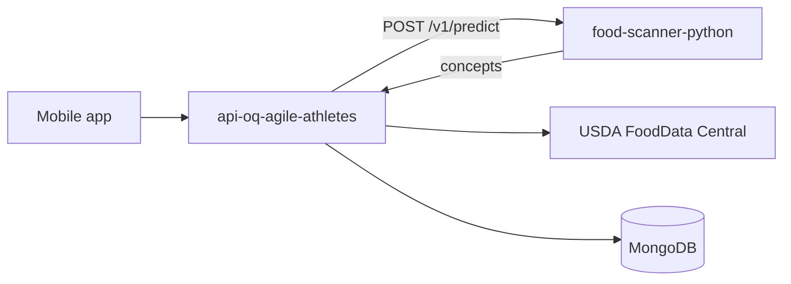

# OQ Agile Athletes API

Node/Express + TypeScript API for the OQ Agile Athletes mobile app. Deployed on [Render](https://render.com).

## Food vision (Python)

Food photo recognition uses a **separate Python service** ([Food-Scanner-Python](https://github.com)) when configured. The Node API calls it server-side; the mobile app never talks to Python directly.



### Environment variables

| Variable | Description |
|----------|-------------|
| `FOOD_VISION_URL` | Python service base URL (no trailing slash), e.g. `https://food-scanner-python.onrender.com` |
| `FOOD_VISION_API_KEY` | Shared secret — must match Python `FOOD_VISION_API_KEY` |
| `FOOD_VISION_PROVIDER` | `http` (Python) or `clarifai`. Defaults to `http` when `FOOD_VISION_URL` is set |
| `FOOD_VISION_TIMEOUT_MS` | Predict timeout (default `60000`) |
| `USDA_API_KEY` | Nutrition enrichment after vision |
| `FitnessOnePAT` / `CLARIFAI_API_KEY` | Exercise recognition only (not food when provider is `http`) |

Copy `.env.example` to `.env` for local development.

### Deploy order

1. Deploy Python service; wait until `GET /ready` returns `200`.
2. Set `FOOD_VISION_URL` and the same `FOOD_VISION_API_KEY` on this Node service.
3. Deploy Node and smoke-test `POST /analyze-food`.

**Cold start:** Python may return `503` for 1–3 minutes after deploy while the ONNX model loads.

### Avoid double vision calls

`POST /analyze-food` and `POST /foodScan/analyze` each call `analyzeImage()` once. A single user scan that hits **both** routes sends **two** requests to Python. Prefer one route per scan, or pass analyzed `foodItems` to `POST /foodScan` without re-analyzing.

### Meal nutrition totals (important)

Vision returns a **`primaryConcept`** (top-1 label) and optional **`concepts`** alternates (confidence ≥ 0.15). The API response includes:

- **`primary`** — use this for calories / macros on the summary card
- **`alternates`** — display only; do **not** sum into total nutrition
- **`foodItems`** — `[primary]` only (backward compatible; must not be summed across all matches)

Misclassified packaged food (e.g. chicken → apple pie) is a Food-101 limitation; totals are still a **single** USDA lookup for the primary label.

### Routes

- `POST /analyze-food` — preview + `isFood` + `primary` / `alternates`
- `POST /foodScan/analyze` — analyze + save **primary only** to Mongo

## Mind Center (mental wellness quiz)

Mounted at **`/quiz`** (no `/mental` API). Powers the Assessment flow in the mobile app.

| Method | Path | Purpose |
|--------|------|---------|
| GET | `/quiz/status` | Seed health, classifier info, `readyForQuizUi` / `readyForPredict` |
| GET | `/quiz/quiz` | 23 questions (`s3`–`s25`), sorted, `selected: null` |
| GET | `/quiz/categories` | 4 outcome categories |
| POST | `/quiz/predict` | Body: all `s3`…`s25` answers → category + description + suggestion |
| POST | `/quiz/addQuestions` | Manual seed (array) |
| POST | `/quiz/addCategories` | Manual seed (array) |

**Classifier:** `utils/mentalClassifier.ts` — sum-based thresholds on anger (s12–s18) and anxiety (s19–s25); risk items (s3–s11) can lower thresholds. Outcomes: labels 0–3 matching `data/quizCategories.json`.

**Auto-seed:** On startup, empty or **legacy** collections (e.g. old “Low Anxiety” categories) are replaced from `data/quizQuestions.json` and `data/quizCategories.json`.

**Mobile:** Point `Quiz.jsx` at this API base URL (e.g. `https://api-oq-agile-athletes.onrender.com`) instead of `fitness-one-server`.

## Scripts

```bash
npm run dev    # development
npm run build  # compile TypeScript
npm start      # run dist/index.js
```
