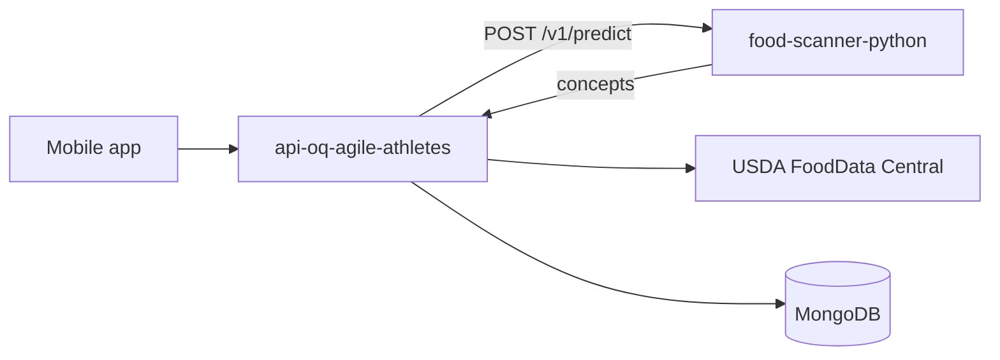

# OQ Agile Athletes API

Node/Express + TypeScript API for the OQ Agile Athletes mobile app. Deployed on [Render](https://render.com).

## Food vision (Python)

Food photo recognition uses a **separate Python service** ([Food-Scanner-Python](https://github.com)) when configured. The Node API calls it server-side; the mobile app never talks to Python directly.



### Environment variables

| Variable | Description |
|----------|-------------|
| `FOOD_VISION_URL` | Python service base URL (no trailing slash), e.g. `https://food-scanner-python.onrender.com` |
| `FOOD_VISION_API_KEY` | Shared secret — must match Python `FOOD_VISION_API_KEY` |
| `FOOD_VISION_PROVIDER` | `http` (Python) or `clarifai`. Defaults to `http` when `FOOD_VISION_URL` is set |
| `FOOD_VISION_TIMEOUT_MS` | Predict timeout (default `60000`) |
| `USDA_API_KEY` | Nutrition enrichment after vision |
| `FitnessOnePAT` / `CLARIFAI_API_KEY` | Exercise recognition only (not food when provider is `http`) |

Copy `.env.example` to `.env` for local development.


Post-signup flow: **register → gender → experience → avatar → weight**. See **`ONBOARDING_API.md`** for the full contract.

| Method | Path |
|--------|------|
| POST | `/auth/register`, `/auth/login` |
| GET | `/user/:id` |
| PATCH | `/user/:id/gender`, `/experience`, `/weight` |
| PUT | `/user/:id/avatar` (file or preset URL JSON) |

Legacy routes **`/auth/signup`** and **`/auth/signin`** remain for older clients. Set **`JWT_SECRET`** in production. Google auth is **not** implemented on this API yet.

## Workflow email (Upstash + Nodemailer)

**`POST /auth/register`** and **`POST /auth/signup`** send a one-time welcome email (non-blocking) when `EMAIL_USER` and `EMAIL_APP_PASSWORD` are set.

Scheduled fitness emails and password reset share the same Gmail transporter. See **`WORKFLOW_EMAIL_API.md`**.

Expo web for email links: copy **`EAS_HOSTING_FRONTEND_PROMPT.md`** into your mobile repo, deploy with EAS Hosting, then set Render `FRONTEND_URL` to that HTTPS URL.

| Method | Path |
|--------|------|
| POST | `/workflow/daily-step-reminders`, `/weekly-progress-summary`, `/leaderboard-alerts`, `/motivation-and-goals` |
| POST | `/auth/forgotpassword`, `/auth/resetpassword` |
| PATCH | `/user/:id/notifications` — sync email prefs from the app |

### Deploy order

1. Deploy Python service; wait until `GET /ready` returns `200`.
2. Set `FOOD_VISION_URL` and the same `FOOD_VISION_API_KEY` on this Node service.
3. Deploy Node and smoke-test `POST /analyze-food`.

**Cold start:** Python may return `503` for 1–3 minutes after deploy while the ONNX model loads.

### Avoid double vision calls

`POST /analyze-food` and `POST /foodScan/analyze` each call `analyzeImage()` once. A single user scan that hits **both** routes sends **two** requests to Python. Prefer one route per scan, or pass analyzed `foodItems` to `POST /foodScan` without re-analyzing.

### Meal nutrition totals (important)

Vision returns **`primaryConcept`** (top-1) and **`concepts`** alternates. The API applies confidence gates (see `NODE_INTEGRATION_PROMPT.md`):

- **`primary`** + **`foodItems`** — only when `identificationQuality === "high"` (confidence ≥ `FOOD_SCAN_PRIMARY_MIN_CONFIDENCE`, default **0.5**)
- **`visionSuggestion`** — when below 0.5; show as unverified guess, **no meal totals**
- **`alternates`** — labels ≥ 0.15 only; display / pick for correction; do **not** sum

Low-confidence mislabels (e.g. chicken → lasagna at 22%) return `needsManualSelection: true` and empty `foodItems`.

### Routes

- `POST /analyze-food` — preview scan
- `GET /analyze-food/search?q=` — USDA manual search
- `POST /analyze-food/correct` — `{ foodName }` → trusted primary (no save)
- `POST /foodScan/analyze` — analyze; auto-saves only when high confidence
- `GET /foodScan/search?q=` — USDA search
- `POST /foodScan/confirm` — `{ userId, foodName }` — save after manual correction

Full mobile contract: **`NODE_INTEGRATION_PROMPT.md`**.

## AI Trainer chat (`/chat`)

Fitness One–compatible AI coach (Cohere). Mounted at `/chat` in `index.ts`.

| Method | Path | Purpose |
|--------|------|---------|
| GET | `/chat/status` | Cohere configured?, rate limit, endpoint list |
| POST | `/chat/generate` | Body: `{ prompt, chatHistory? }` → `{ generations: [{ text }] }` |
| POST | `/chat/save-chat` | Body: `{ userId, title, messages, chatId? }` — upsert by title or update by `chatId` |
| GET | `/chat/get-chat/:userId` | All saved chats (newest first) |
| GET | `/chat/get-chat-by-id/:chatId` | Single chat |
| DELETE | `/chat/delete-chat/:chatId` | Delete by Mongo `_id` |

**Env:** `COHERE_API_KEY` (required), `COHERE_MODEL` (default `command-r7b-12-2024` — do **not** use retired `command`), `CHAT_RATE_LIMIT_PER_MINUTE` (default `15`, no Arcjet).

**Messages** stored as `{ type: 'user' \| 'bot', text, createdAt }` in collection `ai_chats`.

**Multi-turn:** Optional `chatHistory` / `messages` array on `/chat/generate` is sent to Cohere as `chat_history` (planScreen still works with empty history).

Point the mobile app `api/axios.js` base URL to this API (not `fitness-one-server`) when ready.

## Mind Center (mental wellness quiz)

Mounted at **`/quiz`** (no `/mental` API). Powers the Assessment flow in the mobile app.

| Method | Path | Purpose |
|--------|------|---------|
| GET | `/quiz/status` | Seed health, classifier info, `readyForQuizUi` / `readyForPredict` |
| GET | `/quiz/quiz` | 23 questions (`s3`–`s25`), sorted, `selected: null` |
| GET | `/quiz/categories` | 4 outcome categories |
| POST | `/quiz/predict` | Body: all `s3`…`s25` answers → category + description + suggestion |
| POST | `/quiz/addQuestions` | Manual seed (array) |
| POST | `/quiz/addCategories` | Manual seed (array) |

**Classifier:** `utils/mentalClassifier.ts` — sum-based thresholds on anger (s12–s18) and anxiety (s19–s25); risk items (s3–s11) can lower thresholds. Outcomes: labels 0–3 matching `data/quizCategories.json`.

**Auto-seed:** On startup, empty or **legacy** collections (e.g. old “Low Anxiety” categories) are replaced from `data/quizQuestions.json` and `data/quizCategories.json`.

**Mobile:** Point `Quiz.jsx` at this API base URL (e.g. `https://api-oq-agile-athletes.onrender.com`) instead of `fitness-one-server`.

## Scripts

```bash
npm run dev    # development
npm run build  # compile TypeScript
npm start      # run dist/index.js
```
